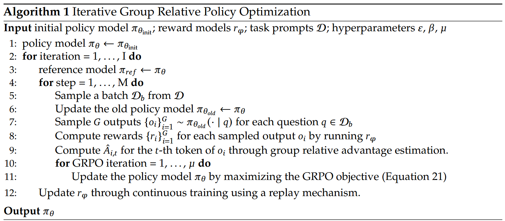
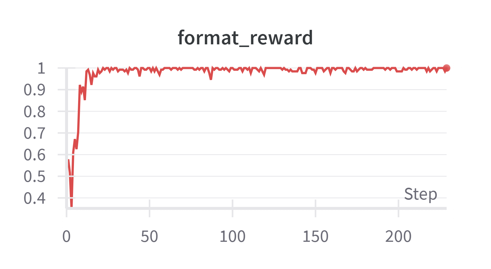
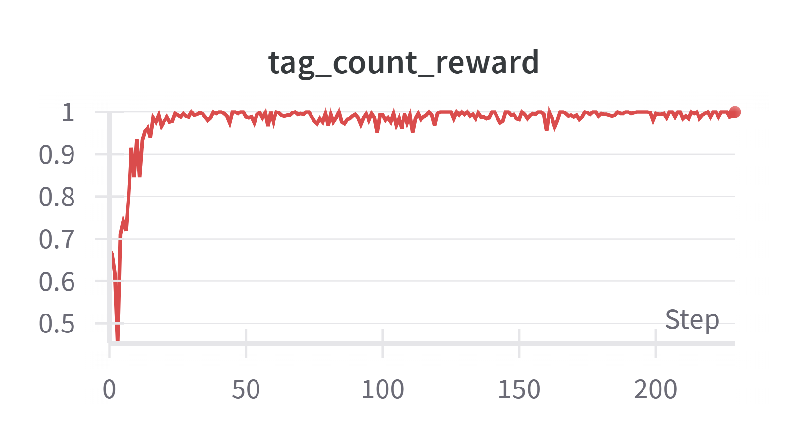
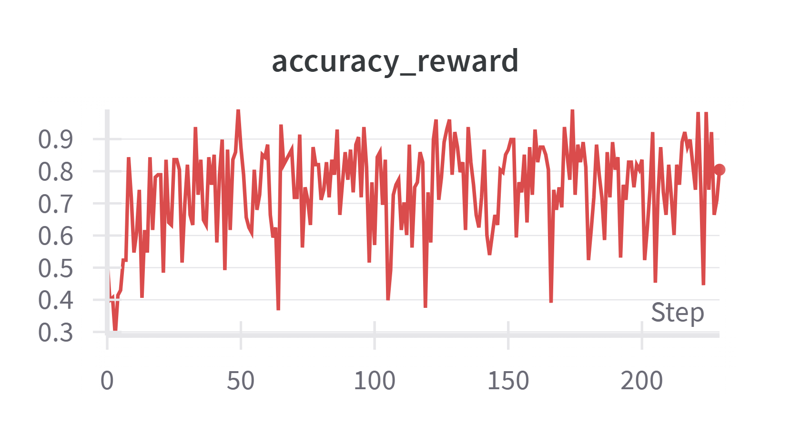
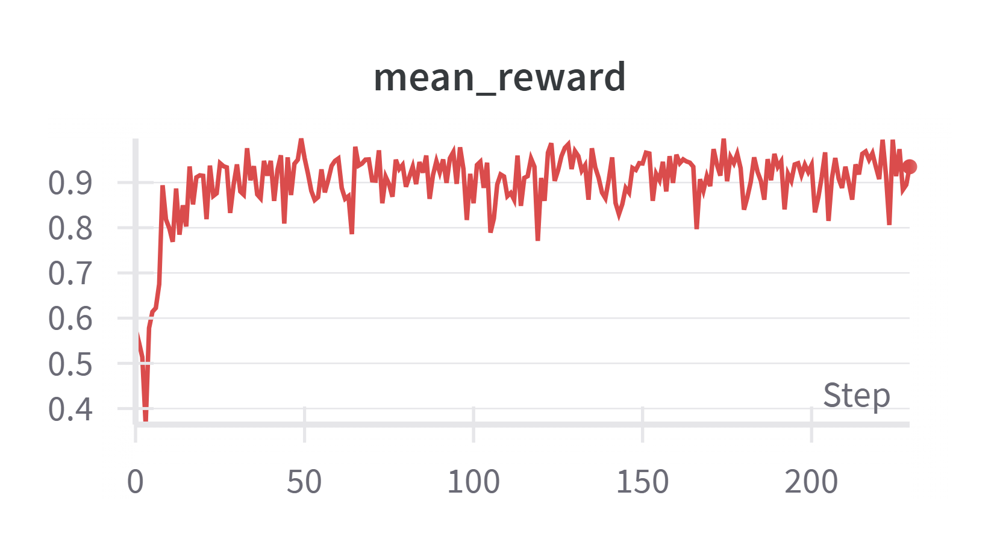
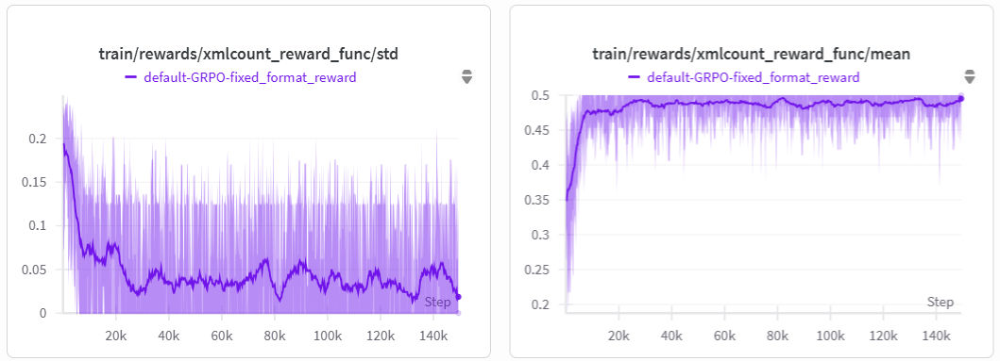
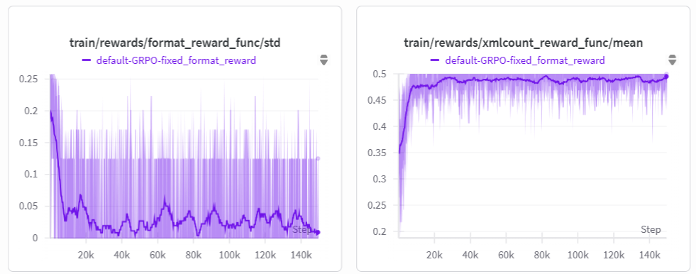
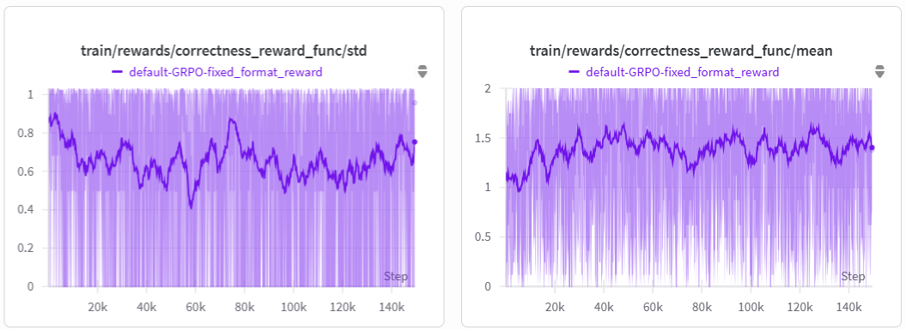
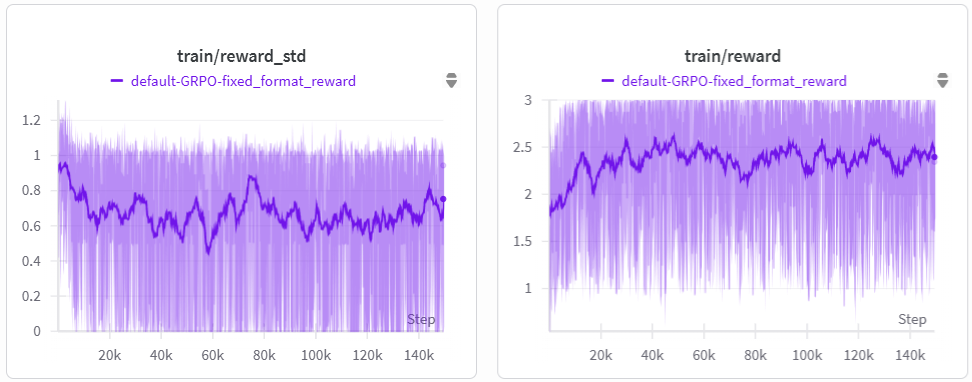

# GRPO implementation from scratch
A naive implementation of GRPO (Group Relative Policy Optimization). 
This implementation is only meant to understand the algorithm. 
It is designed to run in a single GPU (I used a 4090). 
You can set a relative normal batch size and number of generation, because I use micro batch forward and backward. 
This feature enable you to train model more stably. 

这个实现只是为了理解算法。
它设计用于在单 GPU（我使用的是 4090）上运行。
你可以设置相对正常的批次大小和生成次数，因为我使用的是向前和向后的微批次。
这一功能可以让你更稳定地训练模型。

## How to run this repo

### Setup

```bash
conda create -n grpo python=3.10 -y
conda activate grpo
pip install torch
pip install transformers datasets wandb
```

### Run code

```bash
cd src
bash run_train.sh
```

This will create a log file as `run_train.log`. 

I only use partial data of `gsm8k` dataset (1024 QAs), and training on 4090 takes 2h approximately. 

### Run GRPO trainer by huggingface

```bash
cd src_grpo_trainer
bash train.sh
```


## GRPO explained

GRPO 起源于 [DeepSeekMath](https://arxiv.org/abs/2402.03300), 是一种高效且有效的强化学习算法。GRPO的核心思想是通过**组内相对奖励**来估计基线（baseline），从而避免使用额外的价值函数模型（critic model）与 PPO 相比，显着减少了训练资源 (PS: 他不需要 actor-critic网路，两个与训练模型相当的模型)。传统的PPO算法需要训练一个价值函数来估计优势函数（advantage function），而GRPO通过从同一问题的多个输出中计算平均奖励来替代这一过程，显著减少了内存和计算资源的消耗。


从图上可以看出，GRPO 与PPO 的主要区别有：

- GRPO 省略了 value function model 和 reward model.
- GRPO reward 计算，改成了一个问题 q 生成多个回答 r, 然后基于 reward  function打分。
- PPO 优势函数计算时，KL 是包含在GAE内部的。 GRPO 直接挪到了外面，同时修改了计算方法。


### PPO


$$
\mathcal{J}\_{\text{PPO}}(\theta) = \mathbb{E}\_{q \sim D,\ o \sim \pi_{\theta_{\text{old}}}(\cdot|q)} \left[ \min \left( r(\theta) \hat{A}\_t,\ \text{clip} \left( r(\theta),\ 1 - \varepsilon,\ 1 + \varepsilon \right) \hat{A}\_t \right) \right]
$$

其中：
$$
r(\theta) = \frac{\pi_{\theta}(o_t | q, o_{<t})}{\pi_{\theta_{\text{old}}}(o_t | q, o_{<t})}
$$

- $r_t(\theta)$ 是当前策略与旧策略的比值，注意 r 代表 ratio 而不是 reward；
- $\hat{A}\_t$​ 是估计出的优势函数（Advantage），表示当前动作相对平均策略的好坏；
- $\epsilon$ 是超参数，控制允许的策略变动范围（如 0.2）；
- `clip` 操作将 $r_t$ 限制在 $[1-\epsilon, 1+\epsilon]$；
- 取 `min` 是为了在超过 clip 区间时使用“惩罚值”，防止过度优化。

---

clip 对梯度更新的影响是

| Advantage 符号 $\hat{A}\_t$ | $r_t$ 区间                                | 原始项 $r_t \hat{A}\_t$ | clip项 $\text{clip}(r_t, 1-\epsilon, 1+\epsilon) \hat{A}\_t$ | 实际值 = min(...)         | 是否发生clip限制 |
| -------------------------- | ----------------------------------------- | ---------------------- | ----------------------------------------------------------- | ------------------------- | ---------------- |
| $\hat{A}\_t > 0$            | $r_t < 1 - \epsilon$                      | $r_t \hat{A}\_t$        | $(1 - \epsilon)\hat{A}\_t$                                   | $r_t \hat{A}\_t$           | N                |
| $\hat{A}\_t > 0$            | $1 - \epsilon \leq r_t \leq 1 + \epsilon$ | $r_t \hat{A}\_t$        | $r_t \hat{A}\_t$                                             | $r_t \hat{A}\_t$           | N                |
| $\hat{A}\_t > 0$            | $r_t > 1 + \epsilon$                      | $r_t \hat{A}\_t$        | $(1 + \epsilon)\hat{A}\_t$                                   | $(1 + \epsilon)\hat{A}\_t$ | Y                |
| $\hat{A}\_t < 0$            | $r_t < 1 - \epsilon$                      | $r_t \hat{A}\_t$        | $(1 - \epsilon)\hat{A}\_t$                                   | $(1 - \epsilon)\hat{A}\_t$ | Y                |
| $\hat{A}\_t < 0$            | $1 - \epsilon \leq r_t \leq 1 + \epsilon$ | $r_t \hat{A}\_t$        | $r_t \hat{A}\_t$                                             | $r_t \hat{A}\_t$           | N                |
| $\hat{A}\_t < 0$            | $r_t > 1 + \epsilon$                      | $r_t \hat{A}\_t$        | $(1 + \epsilon)\hat{A}\_t$                                   | $r_t \hat{A}\_t$           | N                |

**目标是抑制策略比例变化 $r_t$ 太大或太小导致的梯度爆炸或崩塌**。

- 如果 Advantage 是正的（动作好），希望增加概率，但 clip 会限制其比例最多增加到 $1+\epsilon$。
- 如果 Advantage 是负的（动作差），希望减少概率，但 clip 会限制其比例最多减少到 $1-\epsilon$。

注意这点，DAPO 会在这里改进。

---

这是典型的 **PPO (Proximal Policy Optimization)** 损失函数，用于强化学习中策略更新的稳定性，特别是在文本生成任务如RLHF或GRPO中。其中 $\pi_{\theta}$ and $\pi_{\theta_{\text{old}}}$ 分别是当前的策略模型和旧的策略模型， $\text{clip}$ 操作用于限制策略比率的变化，从而防止策略更新过大。$A_t$ 是优势，通过 Generalized Advantage Estimation (GAE) ，基于一组奖励和一个奖励函数计算出。在 PPO 中，价值函数需要与策略模型一起训练，为了减轻奖励模型的过度优化，标准方法是在每个token 的奖励中从参考模型添加每个token的 KL 散度惩罚项。

### GRPO

#### objective

与 PPO 相比，GRPO 消除了价值函数，并以群体相对方式估计优势。对于特定的问题-答案对 (q, a)，行为策略 $\pi_{\text{old}}$ 采样一组 G 个独立响应 $\{o_i\}\_{i=1}^G$。然后，通过归一化群体级奖励 $\{R_i\}\_{i=1}^G$ 计算第 $i$ 个响应的优势：
$$
\hat{A}\_{i,t} = \frac{r_i - \text{mean}\left(\{R_i\}\_{i=1}^G\right)}{\text{std}\left(\{R_i\}\_{i=1}^G\right)}.
$$
与 PPO 类似，GRPO在原始目标的基础上加上了 KL 散度惩罚项 （**限制当前策略与参考策略之间的差异，不让策略变化太激进。**PPO是在 reward 里加入KL 重复项，GRPO reward 计算不同，因此直接额外加入 KL 项）

从图片中提取的公式如下：
$$
\mathcal{J}\_{\text{GRPO}}(\theta) = \mathbb{E}\_{(q,a) \sim \mathcal{D}, \{o_i\}\_{i=1}^G \sim \pi_{\theta_{\text{old}}}(\cdot \mid q)} \Bigg[ \frac{1}{G} \sum_{i=1}^G \frac{1}{|o_i|} \sum_{t=1}^{|o_i|} \Big( \min \big( r_{i,t}(\theta) \hat{A}\_{i,t}, \, \text{clip}( r_{i,t}(\theta), 1-\varepsilon, 1+\varepsilon ) \hat{A}\_{i,t} \big) - \beta D_{\mathrm{KL}}(\pi_\theta \| \pi_{\text{ref}}) \Big) \Bigg].
$$

- $(q,a) \sim \mathcal{D}$：问题-答案对来自数据集。
- $\{o_i\}\_{i=1}^G$：从旧策略 $\pi_{\text{old}}$ 生成的 $G$ 个候选输出（rollouts）。
- $|o_i|$：第 $i$ 个输出的 token 长度。
- $r(\theta) = \pi_{\theta}(o_t | q, o_{<t}) / \pi_{\theta_{\text{old}}}(o_t | q, o_{<t})$ 

$$
\mathbb{D}\_{\mathrm{KL}} \left[ \pi_\theta \,\|\, \pi_{\text{ref}} \right] = \frac{ \pi_{\text{ref}}(o_{i,t} \mid q, o_{i,<t}) }{ \pi_\theta(o_{i,t} \mid q, o_{i,<t}) } - \log \frac{ \pi_{\text{ref}}(o_{i,t} \mid q, o_{i,<t}) }{ \pi_\theta(o_{i,t} \mid q, o_{i,<t}) } - 1
$$

值得注意的是，GRPO 在 **sample-level 样本级别计算目标**。具体来说，GRPO 首先 sample 内 loss先平均化，再 sample 间 loss 平均化。这一点在 DAPO 里会改变。

---

#### 算法流程



对于每一批数据

- 先更新 $\pi_{old}=\pi_\theta$ 
- 用 $\pi_{old}$ 为每个问题产生 $G$ 个 rollout
- 用 reward model/function 计算每条 rollout $o_i$ 的奖励 $r_i$
- 用组内优化估计(归一化)的方式计算 $A_i$ (或者 $A_i^t$，GRPO reward/adavantage 都是 sample-level的，同一 sample 内每个token都一样)
- 迭代用 GRPO loss 更新 $\pi_\theta$

以下是 DeepseekMath 中提及的超参:

| 超参数名称          | 说明                                                         | 论文中设置值 |
| ------------------- | ------------------------------------------------------------ | ------------ |
| 𝜀（epsilon）        | clip 参数，控制概率比的上下界以防止过大更新                  | 0.2          |
| 𝛽（beta）           | KL 正则项系数，用于防止 policy 偏离 reference 过远           | 0.04         |
| 𝜇（mu）             | 每次 rollout 后对该 batch 执行的 GRPO 训练迭代次数           | 1            |
| G（group size）     | 每个问题采样的回答数量，用于计算 group 平均奖励作为 baseline | 64           |
| Max Length          | 每个回答的最大 token 长度                                    | 1024         |
| Training Batch Size | 每次训练的 batch 大小（总生成样本数）                        | 1024         |
| Policy LR           | Policy 模型的学习率                                          | 1e-6         |
| Reward LR           | 奖励模型的学习率                                             | 2e-5         |

---

#### reward

reward 包括 rule-based reward 和 reward model，前者完全基于规则，后者基于大模型作为评估模型，模拟人类偏好。DeepseekMath page 20 交代了奖励的设置，

> The algorithm processes the reward signal to the gradient coefficient to update the model parameter. 
>
> **We divide the reward function as ‘Rule’ and ‘Model’ in our experiments.** 
>
> - Rule refers to judging the quality of a response based on the correctness of the answer
> - Model denotes that we train a reward model to score each response. 
>
> The training data of the reward model is based on the rule judgment. 

---

Deepseek r1-zero使用了规则奖励 (同时因为只有可通过规则评估的数据):

- Accuracy rewards: The accuracy reward model evaluates whether the response is correct. 结果的准确性奖励
- Format rewards: In addition to the accuracy reward model, we employ a format reward model that enforces the model to put its thinking process between ‘<think>’ and ‘</think>’ tags. 格式奖励，主要是 tag。

他们试过过程奖励，但效果不行，容易 reward hacking，且维护 reward model 需要额外计算资源，因此放弃了。

---

Deepseek r1 扩充了额外数据，其中使用生成式的 reward model 来评估 (同时给 ground-truth 和 prediction)。Deepseek R1 page 11 说明了 reward model 是基于 deepseek v3 和偏好数据训练出来的，评估维度为 helpfulness 和 harmlessness。

> Specifically, we train the model using a combination of reward signals and diverse prompt distributions. 
>
> - For reasoning data, we adhere to the methodology outlined in DeepSeek-R1-Zero, which utilizes rule-based rewards to guide the learning process in math, code, and logical reasoning domains. 
> - For general data, we resort to reward models to capture human preferences in complex and nuanced scenarios.
>
> We build upon the DeepSeek-V3 pipeline and adopt a similar distribution of preference pairs and training prompts. 
>
> - For helpfulness, we focus exclusively on the final summary, ensuring that the assessment emphasizes the utility and relevance of the response to the user while minimizing interference with the underlying reasoning process. 
> - For harmlessness, we evaluate the entire response of the model, including both the reasoning process and the summary, to identify and mitigate any potential risks, biases, or harmful content that may arise during the generation process. 
>
> Ultimately, the integration of reward signals and diverse data distributions enables us to train a model that excels in reasoning while prioritizing helpfulness and harmlessness.

同时，deepseek-r1 zero 训练时出现语言混乱的情况，为了解决这点，deepseek-r1 加入了语言一致性 reward，基于 CoT 中目标语言的比例计算。虽然这回导致模型性能会少量降低，但和人类偏好更对齐。

## 

## GRPO implementation explained

### 数据准备 src/prepare_data.py

将推理任务和答案准备好，在  `openai/gsm8k` 数据集中 answer 字段的答案是长答案 + ### 后的短答案。在判断是否模型答对问题时，不会中间过程进行评估，而是对结果评估，因此实际只需要将短答案提取。

以下是 `openai/gsm8k` 的数据对示例:

```markdown
Question:
Natalia sold clips to 48 of her friends in April, and then she sold half as many clips in May. How many clips did Natalia sell altogether in April and May?

Answer:
Natalia sold 48/2 = <<48/2=24>>24 clips in May.
Natalia sold 48+24 = <<48+24=72>>72 clips altogether in April and May.
#### 72
```

以下是代码中的处理代码，我们将格式要求作为 system prompt，与问题构成对话。部分实现里会加入one shot QA 示例。

```python
efault_system_prompt = """A conversation between User and Assistant. The user asks a question, and the Assistant solves it.
The assistant first thinks about the reasoning process in the mind and then provides the user with the answer. The reasoning process and answer are enclosed within <think> </think> and <answer> </answer> tags, respectively, i.e., <think>\n reasoning process here \n</think>\n<answer>\n answer here \n</answer>.
"""

def extract_final_answer(text):
	if "####" not in text:
		return None
	return text.split("####")[1].strip()


def make_conversation(example, system_prompt=None):
	prompt = []

	if system_prompt is not None:
		prompt.append({"role": "system", "content": system_prompt})
	
	prompt.append({"role": "user", "content": example['question']})

	return {"prompt": prompt, "solution": extract_final_answer(example['answer'])}

dataset = load_dataset('openai/gsm8k', 'main', split='train')

dataset_formatted = dataset.map(
    partial(
        make_conversation, 
        system_prompt=system_prompt,
    ),
)
dataset_formatted = dataset_formatted.map(
    partial(add_len, tokenizer=tokenizer),
)
```

由于本项目是最低的实现，我对问题和答案长度进行了限制，希望模型不会遇到太复杂的问题而产生很长的 response。

```python
def add_len(example, tokenizer):
    # 计算 token 数；去掉 special tokens 保持一致性
    prompt_ids  = tokenizer.apply_chat_template(example["prompt"], tokenize=True, add_generation_prompt=True)
    answer_ids  = tokenizer.encode(example["answer"],  add_special_tokens=False)
    example["prompt_len"]  = len(prompt_ids)
    example["answer_len"]  = len(answer_ids)
    return example

dataset_formatted = dataset_formatted.filter(
    lambda x: x["prompt_len"] <= 300 and x["answer_len"] <= 200,
)
dataset_formatted = dataset_formatted.select(range(1024))

```


### 模型处理 src/model_utils.py

很短，仅有两个函数

- 优化模型设置: 修改设置，使显存占用降低
- 冻结模型: 参考模型需要冻结，以用于计算KL散度

```python
def optimize_model_settings(model):
	model.config.use_cache = False
	model.gradient_checkpointing_enable()


def freeze_model(model):
	model.eval()
	for param in model.parameters():
		param.requires_grad = False
```


### grpo相关util src/grpo_utils.py

有3个封装的函数，每个函数都有每个步骤的注释。

- log prob 的计算函数
- completion 的掩码
- rollout 生成
- grpo loss 计算

log prob 的计算就是正常 label shift 后，获取对应 label 的 log prob，注意不需要 sum，因为后面还需要加上 KL 散度。transformers 有这个函数，但我还是重写了。

```python
def get_per_token_log_probs(
	model: AutoModelForCausalLM,
	input_ids: torch.Tensor,
	attention_mask: torch.Tensor,
):
	"""
	计算每个 token 的 log-probability
	"""
	# label shift
	target_ids = input_ids[:, 1:]
	logits = model(input_ids=input_ids, attention_mask=attention_mask).logits[:, :-1, :]
	# 计算 per token 的 log-probability
	# 根据 `input_ids` 这个索引(vocab id)，从 `log_probs` 里取出对应位置的 log-probability
	log_probs = torch.nn.functional.log_softmax(logits, dim=-1)
	per_token_log_probs = log_probs.gather(dim=-1, index=target_ids.unsqueeze(-1)).squeeze(-1)

	return per_token_log_probs
```

completion 的掩码，根据 eos_token_id 来获取 completion 的位置。这个函数参考了 grpo trainer 中同名函数的实现。

```python
def create_completion_mask(completion_ids, eos_token_id):
	"""
	根据 completion_ids 创建 completion_mask，将 eos_token_id 之后置为 false
	"""
	#  用 mask 排除掉 eos token 之后的部分，保留 prompt 和 completion 的有效部分，计算 completion_mask 的目的是计算 completion 对应的 log prob
	is_eos = completion_ids == eos_token_id
	eos_idx = torch.full((is_eos.size(0),), is_eos.size(1), dtype=torch.long, device=completion_ids.device)
	# 检查每一行是否有 eos token
	mask_exists = is_eos.any(dim=1) 
	# 将有 eos 的行的 eos_idx 设置为对应的 eos token 的位置，其他行保持 eos_idx.size(1) 的值， 即最大值	
	eos_idx[mask_exists] = is_eos.int().argmax(dim=1)[mask_exists]  
	# 每行就是 [0, 1, 2, ..., max_completion_length-1] 的序列
	sequence_indices = torch.arange(is_eos.size(1), device=completion_ids.device).expand(is_eos.size(0), -1)
	# 生成的 completion_mask，1 表示有效部分，0 表示无效部分 
	completion_mask = (sequence_indices <= eos_idx.unsqueeze(1)).to(torch.int64)
	return completion_mask
```

rollout 生成，虽然 transformers 的 model.generate 函数不是很高效，grpo trainer 中也采用 vllm 来生成 rollout，但为了简易型我还是用了 model.generate，其实还跟 vllm 不支持 jupyter notebook 相关。

```python
@torch.no_grad()
def generate_rollouts(
	model: AutoModelForCausalLM, 
	tokenizer: AutoTokenizer, 
	prompts: list[list[dict[str, str]]] | list[str], # prompts maybe a list of list or list of str
	num_of_roullout:int=8,
	max_length: int = 1024,
	temperature: float = 1.0,
	top_p: float = 1.0,
	top_k: int = 50,
	):
	
	model.eval()
	device = model.device

	# 1. 准备 model inputs
	# 1.1 tokenize prompt
	if tokenizer.pad_token_id is None:
		tokenizer.pad_token_id = tokenizer.eos_token_id

	prompts = [
		maybe_apply_chat_template(a_prompt, tokenizer)
		for a_prompt in prompts
	]
	model_inputs = tokenizer(
		prompts,
		return_tensors="pt",
		padding=True,
		padding_side="left",
		return_attention_mask=True,
	).to(device)

	# 1.2 duplicate prompt num_rollouts times
	# input_ids 和 attention_mask 都是 bs(1) x sl 的, 需要在 batch 维度上重复 num_rollouts 次
	model_inputs["input_ids"] = model_inputs["input_ids"].repeat_interleave(num_of_roullout, dim=0)
	model_inputs["attention_mask"] = model_inputs["attention_mask"].repeat_interleave(num_of_roullout, dim=0)
	# 取 sl 维度为 prompt 长度
	prompt_length = model_inputs["input_ids"].shape[1] 
	

	# 2. sample completions / rollouts
	generation_config = GenerationConfig(
		do_sample=True,
		top_p=top_p,
		top_k=top_k,
		temperature=temperature,
		max_length=max_length,
		pad_token_id=tokenizer.pad_token_id,
	)
	sequence_ids = model.generate(
		**model_inputs, 
		generation_config=generation_config
	)

	# 3. prepare return
	completions = tokenizer.batch_decode(
		sequence_ids[:, prompt_length:], skip_special_tokens=True
	)

	# completion mask 是指 completion id 对应的 mask
	# prompt 部分全是 0， completion 部分需要根据 eos_token 来区分 completion 的有效部分和无效部分
	completion_mask = torch.zeros_like(sequence_ids, dtype=torch.int64)
	partial_completion_mask = create_completion_mask(sequence_ids[:, prompt_length:], tokenizer.eos_token_id)
	completion_mask[:, prompt_length:] = partial_completion_mask

	sequence_mask = torch.cat([model_inputs["attention_mask"], partial_completion_mask], dim=1)

	return sequence_ids, sequence_mask, completion_mask, completions
```

grpo loss 计算，涉及 log prob ratio 的 clip，KL 散度的计算， completion mask 掩码计算 loss，和先样本内平均后样本间平均。

```python
def get_grpo_loss(
	model: AutoModelForCausalLM,
	sequence_ids: torch.Tensor,
	sequence_mask: torch.Tensor,
	completion_mask: torch.Tensor,
	advantage_per_sample: torch.Tensor,
	prob_per_token_old: torch.Tensor,
	prob_per_token_reference: torch.Tensor,
	epsilon: float,
	beta: float = 0.04,
):
	
	# 计算 policy 的 log prob
	prob_per_token_policy = get_per_token_log_probs(
		model,
		input_ids=sequence_ids,
		attention_mask=sequence_mask,
	)

	# 计算每个 token 的 loss
	coef_1 = (prob_per_token_policy - prob_per_token_old).exp()
	coef_2 = torch.clamp(coef_1, 1 - epsilon, 1 + epsilon)
	loss_per_token_1 = coef_1 * advantage_per_sample.unsqueeze(1)
	loss_per_token_2 = coef_2 * advantage_per_sample.unsqueeze(1)
	loss_per_token = -torch.min(loss_per_token_1, loss_per_token_2)

	# per token 的 KL 散度
	kl_divergence_per_token = (prob_per_token_policy - prob_per_token_reference).exp() - (prob_per_token_policy - prob_per_token_reference) - 1
	loss_per_token += beta * kl_divergence_per_token

	# label shift completion_mask to match per_token_loss
	loss_per_completion = (loss_per_token * completion_mask[:, 1:]).sum(dim=1)
	length_per_completion = completion_mask[:, 1:].sum(dim=1).clamp(min=1)
	loss = (loss_per_completion / length_per_completion).mean()

	return loss

```

### 规则奖励函数 src/reward.py

包含若干规则和 grpo 的最内 advantage 计算函数

我使用了 format 奖励、xml tag奖励、准确率奖励

```python
def extract_answer(text):
	match = re.search(r'<answer>\n(.*?)\n</answer>', text, re.DOTALL)
	if match:
		return match.group(1).strip()
	return None


def format_reward(completion, **kwargs):
	"""
	检查预测文本是否符合特定格式要求。e.g., <think>\n...\n</think>\n<answer>\n...\n</answer>
	kwargs 参数可以用于传递额外的配置，但在此函数中未使用。
	"""
	pattern = r"^<think>\n.*?\n</think>\n<answer>\n.*?\n</answer>$"
	if re.match(pattern, completion, re.DOTALL | re.MULTILINE):
		return 1.0
	else:
		return 0.0
	

def tag_count_reward(completion, **kwargs):
	"""
	检查文本中 <think> 和 <answer> 标签的数量。
	"""
	score = 0.0
	if completion.count("<think>\n") == 1:
		score += 0.25
	if completion.count("\n</think>\n") == 1:
		score += 0.25
	if completion.count("\n<answer>\n") == 1:
		score += 0.25
	if completion.count("\n</answer>") == 1:
		score += 0.25
	return score


def reasoning_steps_reward(completion, **kwargs):

	pattern = r"(Step \d+:|^\d+\.|\n-|\n\*|First,|Second,|Next,|Finally,)"
	matches = re.findall(pattern, completion)
	score = min(1.0, len(matches) / 3)  # 奖励 3 次以上
	return score


def accuracy_reward(completion, solution, **kwargs):
	"""
	计算预测文本与真实答案之间的准确度奖励。
	"""
	full_answer_content = extract_answer(completion)
	if full_answer_content is None:
		return 0.0

	gold_parsed = parse(solution)
	answer_parsed = parse(full_answer_content)

	try:
		score = float(verify(gold_parsed, answer_parsed))
	except Exception as e:
		print(f"verify failed: {e}, answer: {answer_parsed}, gold: {gold_parsed}")
		return 0.0

	return score
	

def compute_grpo_reward(completions, solutions, reward_funcs, reward_weights=None):

	if reward_weights is None:
		reward_weights = [1.0/len(reward_funcs)] * len(reward_funcs)

	assert len(reward_weights) == len(reward_funcs), "reward_weight and reward_funcs must have the same length"

	rewards_per_sample_per_func = torch.zeros(len(completions), len(reward_funcs))

	for i, (a_completion, a_solution) in enumerate(zip(completions, solutions)):
		for j, reward_func in enumerate(reward_funcs):
			rewards_per_sample_per_func[i, j] = reward_func(a_completion, solution=a_solution)

	reward_weight_tensor = torch.tensor(reward_weights)
	reward_per_completion = (rewards_per_sample_per_func * reward_weight_tensor).sum(dim=1)

	# return avergaed score of different reward functions
	reward_per_reward_func = rewards_per_sample_per_func.mean(dim=0)

	return reward_per_completion, reward_per_reward_func
```

grpo 组内 advantage 计算，注意组是指同一个问题内部计算 mean 和 std。

```python
def compute_group_advantage(reward_per_sample: torch.Tensor, num_generations: int=None, eps: float = 1e-8, scale_rewards: bool = True):
	"""
	基于 reward 计算 advantage
	"""
	if num_generations is None:
		num_generations = reward_per_sample.shape[0]

	# 计算同一个prompt的多次生成的平均奖励和标准差
	mean_grouped_rewards = reward_per_sample.view(-1, num_generations).mean(dim=1)
	std_grouped_rewards = reward_per_sample.view(-1, num_generations).std(dim=1)
	
	# 将 mean 和 std 重复 num_generations 次，以便与 rewards 的形状匹配
	mean_grouped_rewards = mean_grouped_rewards.repeat_interleave(num_generations, dim=0)
	std_grouped_rewards = std_grouped_rewards.repeat_interleave(num_generations, dim=0)
	group_advantage = reward_per_sample - mean_grouped_rewards
	if scale_rewards:
		group_advantage /= (std_grouped_rewards + eps)

	return group_advantage

```


### grpo 主函数 src/main_minibatch.py

grpo 的主要流程分为:

- rollout 生成
- reward 计算
- 旧 policy model (当前 policy model)和参考 model 的 log prob 计算
- grpo loss 计算并反向传播

#### rollout 生成

```python

prompts = [example['prompt'] for example in batch]
solutions = [example['solution'] for example in batch]

sequence_ids, sequence_mask, completion_mask, completions = generate_rollouts(
    model_policy, 
    tokenizer, 
    prompts, 
    num_of_roullout=n_roullout, 
    max_length=max_length, 
    temperature=1.0, 
    top_p=0.9, 
    top_k=50,
)
```


#### reward 计算

```python
reward_funcs = [format_reward, tag_count_reward, accuracy_reward]
reward_weights = [0.5, 0.5, 1.0]

solutions = [s for s in solutions for _ in range(n_roullout)]

reward_per_completion, reward_per_reward_func = compute_grpo_reward(
    completions, 
    solutions, 
    reward_funcs,
    reward_weights,
)

group_advantage_per_sample = compute_group_advantage(
    reward_per_completion
).to(device)
```

reward weight 最好倾向 accuracy_reward，其他格式相对好学习到。

#### 旧 policy model 和参考 model 的 log prob 计算

```python
with torch.no_grad():
    prob_per_token_old = []
    prob_per_token_reference = []

    for i in range(0, len(sequence_ids), batch_size_micro_for_no_grad):
        sequence_ids_batch = sequence_ids[i:i + batch_size_micro_for_no_grad]
        sequence_mask_batch = sequence_mask[i:i + batch_size_micro_for_no_grad]

        prob_old_batch = get_per_token_log_probs(
            model_policy,  # 使用当前policy作为old policy
            input_ids=sequence_ids_batch,
            attention_mask=sequence_mask_batch,
        )
        prob_ref_batch = get_per_token_log_probs(
            model_reference,
            input_ids=sequence_ids_batch,
            attention_mask=sequence_mask_batch,
        )

        prob_per_token_old.append(prob_old_batch)
        prob_per_token_reference.append(prob_ref_batch)

    # 将mini batch结果拼接
    prob_per_token_old = torch.cat(prob_per_token_old, dim=0)
    prob_per_token_reference = torch.cat(prob_per_token_reference, dim=0)

```

计算这里用了 torch.no_grad()，但 rollout 太多了还是会超显存，因此这里还是采用 mini batch


#### grpo loss 计算并反向传播

这里 FWD 和 BWD 都采用了 mini batch

```python
for _ in range(mu):

    optimizer.zero_grad()
    for i in range(0, len(sequence_ids), batch_size_micro):

        sequence_ids_batch = sequence_ids[i:i + batch_size_micro]
        sequence_mask_batch = sequence_mask[i:i + batch_size_micro]
        completion_mask_batch = completion_mask[i:i + batch_size_micro]
        group_advantage_per_sample_batch = group_advantage_per_sample[i:i + batch_size_micro]

        # 使用预先计算的固定old_policy_prob和reference_prob
        prob_per_token_old_batch = prob_per_token_old[i:i + batch_size_micro]
        prob_per_token_reference_batch = prob_per_token_reference[i:i + batch_size_micro]

        loss = get_grpo_loss(
            model_policy,
            sequence_ids_batch,
            sequence_mask_batch,
            completion_mask_batch,
            group_advantage_per_sample_batch,
            prob_per_token_old_batch,
            prob_per_token_reference_batch,
            epsilon,
            beta
        )
        loss.backward()
    optimizer.step()
```


## GRPO 结果










整体 reward 曲线算正常。tag 和 format 很快学习到，accuracy 比较难学，且波动也很大。


## GRPO trainer 结果









基于 GRPO trainer 的结果更好点，其 xml reward 上限为 0.5，format reward 上限为 0.5，correctness reward 上限为 2，所以其reward 上限为3(2~2.5之间波动，平均2.25)。我自己的代码是三者的平均值，所以上限为 1 (0.8~1之间波动，平均0.9)。

